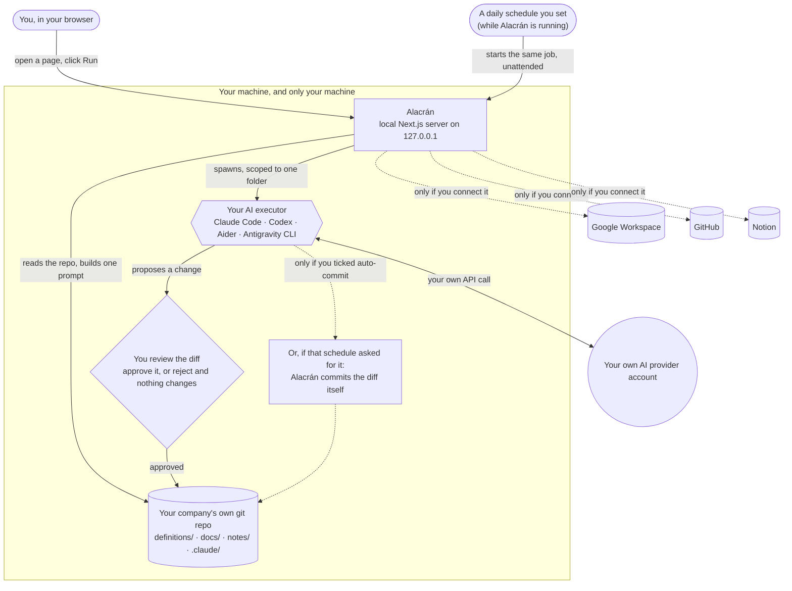

<div align="center">


# Alacrán

**Give your AI a memory of your business, on your own machine.**

[](https://github.com/kwakuoseikwakye/alacran/actions/workflows/ci.yml)
[](LICENSE)
[](https://github.com/kwakuoseikwakye/alacran-releases/releases/latest)

[Download](#install) | [Quick start](#quick-start) | [How it works](#how-it-works) | [Contributing](CONTRIBUTING.md) | [Changelog](CHANGELOG.md)

</div>

---

Every new AI chat starts as a total stranger. It doesn't know what your
business sells, who your customers are, or how you like things written, so
you end up retyping the same background paragraph before it can actually be
useful to you.

Alacrán fixes that. It's a small app that runs on your own computer. You
describe your business once, in plain language, and it writes that down as
real files in a folder **you** own. From then on, it hands those files to
your coding agent before every task, and shows you exactly what the agent
wants to change before anything gets saved.

There's no hosted service behind any of this. No account, no licence key, and
no server of ours your data could ever reach. It's a local Next.js server
that runs on `127.0.0.1` and opens right in your browser.

## What it actually does

- **Create a company.** One folder holding everything an AI should know
  about a business, scaffolded from one of 7 starter packs (General,
  Software engineering, Sales, Marketing, Customer support, HR & People,
  Leadership).
- **Guided setup.** A plain-language wizard asks about the business domain,
  the stakeholders, how value flows, and where the bottleneck is, then
  writes a structured ontology file for you. Or skip the typing and click
  "Let AI draft it" instead.
- **A "Get Started" button for when you don't know where to start.** Your
  AI reads whatever skills and context you've actually built for this
  company and introduces itself: what it can do here, and what you might
  want to try first. It remembers what it already told you, too, so it
  only re-reads everything if something has genuinely changed since last
  time, not on every single click.
- **Run jobs.** `digest`, `decision`, `retro`, `handoff`, `define-company`,
  `check-inbox`, `check-notion`, `triage-email`, `triage-issue`. Each one
  spawns a headless agent scoped to a single output directory and shows you
  the diff before anything is committed.
- **Let it run while you're not there.** Any job that doesn't need you to
  type something first — `digest`, `handoff`, `check-inbox`, `check-notion`,
  `triage-email`, `orientation` — can be set to run once a day at a time you
  pick. By default the result waits for you as a diff, with a dot on the
  sidebar so you know something's there. Tick **"commit the result for me,
  without asking"** on a schedule and that one runs end to end unattended,
  landing as a real commit you read afterwards instead of before. It's off
  unless you turn it on, one schedule at a time, and it's refused outright on
  the three jobs that read text written by people outside your company
  (`check-inbox`, `check-notion`, `triage-email`) — those always wait for
  you. Turn on **Advanced mode** in Settings to see the control.
- **Edit and version skills.** Browse every skill and slash command across
  all your companies, edit them right in the app, and get real git history
  with per-commit diffs and one-click revert. Every write is its own
  single-file-scoped commit in that company's own repo.
- **Connect your tools.** Detect-and-guide setup for Claude Code, OpenAI
  Codex, Aider, Google Antigravity CLI, Google itself (Gmail and Calendar,
  more than one account if you need it), GitHub, and Notion. Alacrán never
  holds a credential of its own; it just checks whether *your* CLI or
  account is already signed in.
- **Connect MCP tools per company.** Point a company at Canva, Figma,
  Lovable, Docusign, Vercel or freee (accounting/HR) — no CLI to install, no
  key to paste. Alacrán writes the company's own `.mcp.json`; you approve
  and sign in once inside a real session, and the token stays in Claude
  Code's own store. These tools are available in **Open in Terminal** and
  **Get Started** sessions, deliberately *not* to the scoped jobs above,
  which keep their own fixed narrow permissions.
- **See the whole network at a glance.** A visual map of every company on
  your machine and exactly what it's plugged into (which AI runs it, and
  whether Google, GitHub, or Notion are actually connected), so it's
  obvious what's live and what isn't without opening every card.
- **Bring your own agent.** Claude Code by default, with OpenAI Codex,
  Aider, and Google Antigravity CLI selectable per company, so different
  companies can run on whichever agent (or whichever provider account)
  makes sense for them.
- **Settings.** Switch between dark and light themes, check for updates
  on demand instead of waiting for the daily check, and reset a couple of
  one-time local hints if you want to see them again.

## Install

### Download a build

| Platform | File | |
|---|---|---|
| macOS (Apple Silicon / Intel) | `Alacran.dmg` | [Download](https://github.com/kwakuoseikwakye/alacran-releases/releases/latest/download/Alacran.dmg) |
| Debian / Ubuntu | `Alacran.deb` | [Download](https://github.com/kwakuoseikwakye/alacran-releases/releases/latest/download/Alacran.deb) |

**macOS.** Open the `.dmg` and drag Alacrán to Applications. Then, before
the first launch, run this once in Terminal:

```bash
xattr -cr "/Applications/Alacrán.app"
```

The build is ad-hoc signed but **not notarized**, since that requires a
paid Apple Developer account. Without the command above, macOS quarantines
the download and refuses to open it, often with the misleading message
*"Alacrán is damaged and can't be opened."* The app isn't damaged; it just
isn't signed by a registered developer. `xattr -cr` simply clears the
quarantine flag macOS attaches to anything downloaded from the internet.
Right-click then **Open** is not enough on its own for an ad-hoc-signed app
on current macOS.

You only need to do this **once**, for this first install from the download.
Later updates go through the app's own **Update & Restart** button, which
downloads the new build itself — and a file the app downloads is never
quarantined, so no `xattr` step is needed again.

*A signed and notarized pipeline would be a welcome contribution. It needs
a certificate, not code. See the [issue tracker](https://github.com/kwakuoseikwakye/alacran/issues) if you'd like to help.*

**Linux.**

```bash
sudo apt install ./Alacran.deb
# or: sudo dpkg -i Alacran.deb && sudo apt -f install
```

Then launch Alacrán from your applications menu.

Both builds bundle a standalone Next.js server. They start it locally and
open your default browser at `http://127.0.0.1:<port>`.

### Or build from source

See [Development](#development) below.

## Updating

Alacrán checks for a new release once a day and shows a banner when one's
available.

- **Linux**: click **Update & Restart** in the banner. It downloads the new
  `.deb`, installs it through a native `pkexec` password prompt (the same
  kind of prompt GNOME Software already uses), and restarts the app for
  you. If `pkexec` isn't installed, it shows you the exact
  `sudo apt install` command to run instead.
- **macOS**: click **Update & Restart** in the banner. It downloads the new
  build, swaps the installed app for it, and reopens it — no password
  prompt, and no `xattr -cr` needed. That last part surprises people, so:
  the quarantine flag that makes `xattr -cr` necessary is attached by your
  *browser*, not by the file's origin. An update the app downloads itself is
  never quarantined, so there's nothing to clear.

Set `ALACRAN_NO_UPDATE_CHECK=1` if you'd rather turn the check off entirely.

## Uninstalling

- **Linux**: `sudo apt remove alacran` keeps your data.
  `sudo apt purge alacran` also removes Alacrán's own registry and settings
  at `~/.local/share/Alacrán`. Either way, your companies' actual files
  (wherever you put them, e.g. `~/AI-Native/`) are left untouched.
- **macOS**: run `bash scripts/uninstall-macos.sh` from a checkout, or do it
  by hand: drag `/Applications/Alacrán.app` to the Trash, and delete
  `~/Library/Application Support/Alacrán` too if you want its registry gone.

## Prerequisites

Alacrán drives command-line tools that you install and authenticate
yourself. It never stores an API key, and it never proxies a request to a
model provider on your behalf.

**Required**

- **[Node.js](https://nodejs.org/) 20 or newer.** The packaged app runs a
  Node server and needs `node` on your `PATH`. Check with `node -v`.
- **Git.** Every company is a git repository, and every write goes through
  a real commit. Check with `git --version`.
- **A coding-agent CLI**, at least one of:

  | Agent | Install | Notes |
  |---|---|---|
  | Claude Code *(default)* | `npm install -g @anthropic-ai/claude-code` | The only one with fine-grained `Edit(path)` / `Bash(cmd)` permission scoping. Recommended. |
  | OpenAI Codex | `npm install -g @openai/codex` | Coarser permissions (`--sandbox workspace-write`). |
  | Google Antigravity CLI | `curl -fsSL https://antigravity.google/cli/install.sh \| bash` | Coarser permissions (`--dangerously-skip-permissions`). |
  | Aider | `uvx --from aider-chat aider` | Can point at a local model through Ollama. |

  You authenticate these yourself, with your own account. Alacrán just
  checks whether the binary exists and tells you plainly if it doesn't; it
  never installs anything on your behalf.

**Optional**

- **[`gog`](https://gogcli.sh)** (`brew install gogcli`), a Google API CLI
  needed only for the `check-inbox` and `triage-email` commands (read-only
  Gmail access). Alacrán detects it and walks you through installing it if
  it's missing.
- **[GitHub CLI](https://cli.github.com/) (`gh`)**, needed only for the
  optional "back up this company to a private repo" flow.

**Not required:** an Alacrán account, a licence key, or a network
connection for anything other than the AI calls themselves and a
once-a-day version check you can turn off.

## Quick start

1. **Open Alacrán.** A fresh install starts empty and walks you through a
   short onboarding screen with a dependency checklist.
2. **Add a company.** Type a path that doesn't exist yet and Alacrán offers
   to scaffold it from a starter pack. Type a path to an existing directory
   (with `.git` and `.claude` already in it) and it simply registers it.
3. **Answer four questions.** The setup wizard asks what the business does,
   who it serves, how value flows through it, and what's eating up your
   time, then writes `definitions/ontology/company.yaml` for you. Or click
   **Let AI draft tailored entities** and just review what it proposes.
4. **Not sure what's next? Click Get Started.** Your AI reads what's
   actually been set up for this company and tells you, in plain language,
   what it can help with.
5. **Run a job.** Open **Skills**, pick a command, and hit **Run**. The
   agent runs headlessly, scoped to a single output directory. When it's
   done, you get a diff, and nothing is written to git until you approve
   it.

A longer, step-by-step walkthrough (including what to do when macOS blocks
the first launch) lives in
[`landing/how-to-use/`](landing/how-to-use/index.html), which also happens
to be the source for the site's How-to-use page.

## How it works



Solid arrows are what happens on every single run, whether you started it or a
schedule did. Dotted arrows only happen if you turned that particular thing on
— a service you connected, or a schedule you told to commit for itself.
Nothing reaches Google, GitHub, or Notion unless you told it to, and nothing is
committed without you unless you asked for that too. Walked through in words:

1. You click something in the browser. Alacrán, a plain local web server,
   handles the click. (Or nobody clicks anything: a schedule you set earlier
   comes due and starts the exact same job, through the exact same code.)
2. It reads whatever's relevant out of the company's own repo (its
   ontology, its skills, its notes) and turns that, plus what you typed,
   into a single prompt.
3. It spawns your chosen AI executor as a real subprocess, scoped to write
   inside one directory and nowhere else.
4. That subprocess makes its own API call to whichever provider you've
   authenticated (your account, your billing, never Alacrán's).
5. Whatever the agent proposes comes back to you as a diff, not a fait
   accompli. Approve it and it becomes a real git commit. Reject it and
   nothing on disk ever changes. If you weren't at the machine — because it
   ran at 07:00 and you got up at 09:00 — the diff simply waits, and the
   sidebar carries a dot until you've dealt with it. The one exception is a
   schedule you explicitly told to commit for itself: Alacrán still computes
   the diff and still makes the commit, it just doesn't wait for you to read
   it first.

A few design decisions worth knowing, because they constrain everything
else:

- **Your data is plain files in your own git repos.** Alacrán stores only
  its own registry (`~/Library/Application Support/Alacrán` on macOS,
  `$XDG_DATA_HOME` on Linux). Delete the app and every company you made is
  still sitting there, readable without it.
- **Every write is a single-file-scoped commit.** `git add -- <file> && git
  commit -- <file>`, never a bare `git commit` that could sweep up
  unrelated changes in your repo.
- **Two independent gates on every write path:** containment
  (`lib/path-guard.ts`, the resolved real path has to be inside a known
  company's root) and membership (`lib/resolve-known-skill.ts`, it has to
  correspond to an actual known skill file). Both, always, on every read
  and every write.
- **Spawned agents are scoped, not trusted.** Each command's session gets
  `--allowedTools Read,Grep,Glob,Edit(<one directory>)`, plus
  narrowly-pattern-matched `Bash(...)` access only where a command
  genuinely needs a CLI. Blanket `Write` and `--permission-mode
  acceptEdits` are deliberately never used; see
  [v8 in the changelog](CHANGELOG.md) for the live test that proved why.
- **The app detects what changed; the agent never commits.** Alacrán diffs
  the result itself and shows it to you. Approval is a human step by
  construction, not a setting you could accidentally turn off.
- **A scheduled run is the same run, minus the click.** Scheduling adds one
  timer and changes nothing else: same prompt, same tool allowlist, same
  per-company lock, same diff.
- **Auto-commit is opt-in, per schedule, and never the default.** Even with
  it on, the agent still doesn't commit: Alacrán diffs the result itself and
  makes the same single-file-scoped commit it would make if you'd clicked
  approve, through the same containment checks. The only thing that changes
  is whether a person read the diff first. It cannot be turned on at all for
  a job whose prompt carries text written by someone outside the company —
  that's the one case where "nobody looked at it" is the entire risk, so it's
  refused in code rather than left to a checkbox.

For the reasoning behind each of these, [`CHANGELOG.md`](CHANGELOG.md) has
a detailed, dated writeup of every feature that shipped, including the
ones that were investigated and deliberately never built, plus the
security bugs found during live testing. `CLAUDE.md` carries the standing
conventions and a running summary of where the project stands today.

## Development

```bash
git clone https://github.com/kwakuoseikwakye/alacran.git
cd alacran
npm install
npm run dev          # http://localhost:3000
```

| Command | What it does |
|---|---|
| `npm run dev` | Dev server with Fast Refresh |
| `npm test` | Full vitest suite (no network, no real subprocesses) |
| `npm run lint` | ESLint |
| `npx tsc --noEmit` | Type check |
| `npm run build` | Production build |
| `bash scripts/package-macos.sh` | Build `dist/Alacrán.app` + `.dmg` (macOS only) |
| `bash scripts/package-linux.sh` | Build `Alacran.deb` (Debian/Ubuntu) |

**Tech:** Next.js 15 (App Router), React 19, TypeScript, Tailwind v4,
Radix primitives, vitest.

**Testing philosophy.** Every function that shells out or touches the
filesystem takes an injectable `ExecFn`/`SpawnFn` with a real default, so
the suite never spawns a real process, never hits the network, and never
reads the real clock. If you add a new one, follow the same pattern:
a test that needs the real world is a test that will be flaky for
everyone else, sooner or later.

**Layout:**

```
app/          Next.js routes (/, /network, /activity, /skills, /connect)
components/   React components; components/ui/* are shadcn-style primitives
lib/          All logic. *-impl.ts holds the injectable seam, the sibling
              file is the thin "use server" Server Action wrapper.
templates/    The company starter template + 7 starter packs (plain files)
scripts/      Packaging and asset-generation scripts
landing/      The static marketing site (plain HTML/CSS, no build step)
docs/         Design specs and implementation plans, one per slice
```

See [CONTRIBUTING.md](CONTRIBUTING.md) before opening a PR, particularly
the conventions around `components/ui/*` (don't edit them directly) and
design tokens.

## Privacy

There is no analytics, no telemetry, and no crash reporting anywhere in
this app. Not disabled by default; simply not present. Here's the complete
list of what actually leaves your machine:

1. **Your prompts**, to whichever AI a company is pointed at, whenever you
   press Run. That's just the agent CLI doing its job.
2. **A version number check** against the public releases page, at most
   once a day, so the app can tell you when an update exists. An anonymous
   read of a public URL, and you can dismiss or disable it.
3. **Your files to your own private GitHub repo**, only if you press
   Back up.

That's the whole list. The source is right here, so verify it yourself
rather than taking our word for it.

## Status and honest caveats

Alacrán is genuinely used every day by its author, but it's still a young
project maintained by one person. Here are the rough edges, stated
plainly:

- **macOS builds aren't notarized.** You need to run `xattr -cr` on the
  installed app before the first launch. Only that first one — in-app
  updates aren't affected. See [Install](#install).
- **Windows isn't built.** Only macOS and Debian/Ubuntu for now.
- **Auto-commit means what it says.** A schedule with it ticked writes to
  your repo with nobody watching. Every write is still confined to that
  command's own output folder and still lands as its own single-file commit,
  so `git log` and `git revert` are the undo — but if you want a human read
  before anything is written, leave it off, which is how it ships.
- **Scheduled runs need Alacrán to be running.** The timer lives in the
  app's own local server, so runs happen while the app is open (a closed
  browser tab is fine — the server is what matters) and not while it's quit
  or the machine is asleep. A run that was missed fires when the app next
  starts, rather than being skipped for the day. Once a day at a set time is
  all it does; there's no cron expression and no sub-daily interval.
- **`daily-team-log` is per-machine global.** Its config lives at a single
  fixed path, so only one company can have a bootstrapped daily-log setup
  active at a time. Google is different: each company can be assigned its
  own account (or accounts) now, so this limitation doesn't apply there
  anymore.
- **MCP tools are Claude Code only, and remote-only.** Claude Code is the
  only one of the four agents with per-project MCP config; `codex mcp add`
  is machine-wide, and Aider and Google Antigravity CLI have no MCP at all,
  so the button only appears for a company set to Claude Code. Only remote
  (`https://`) servers can be added from the app — a local, command-launched
  server is still `claude mcp add` in a terminal.
- **OpenAI Codex and Aider are wired up but not yet run end to end**
  against a live account from inside this app. Their flags are verified
  against each CLI's real `--help` output, but the full round trip isn't.
  Claude Code is the best-tested path today.
- **No support SLA.** Issues and pull requests are read and genuinely
  welcome, but if you need it to work a particular way on a particular
  timeline, the licence lets you go make that happen yourself.

## Contributing

Bug reports, feature requests, and pull requests are all welcome. Start
with [CONTRIBUTING.md](CONTRIBUTING.md); security issues should go to
[SECURITY.md](SECURITY.md) instead of the public tracker.

## License

[MIT](LICENSE) © Kwaku Osei Kwakye

Brand icons are official [Simple Icons](https://simpleicons.org/) (CC0),
extracted by `scripts/generate-brand-icons.mjs`. Never hand-drawn.
