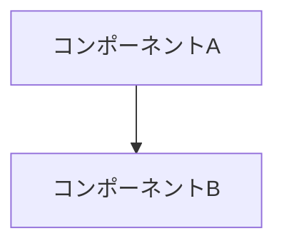

# design.md テンプレート(Kiro公式6見出し)

トップレベル見出しは以下の6つを英語のまま、この順で必ず含める。増減・改名しない。

## 構造

````markdown
# Design Document

## Overview

[何を作るかの要約 + 主要な設計判断(箇条書き3〜5点)。
 requirements.md のどの要件に応える設計かが分かるように書く]

## Architecture

[システム構成の説明 + mermaid図]



## Components and Interfaces

[コンポーネントごとに: 責務 / 入出力インターフェース(シグネチャ・データ形) / 依存。
 具体的なコード断片やコマンド、スキーマを書いてよい]

## Data Models

[扱うデータ構造。ファイルフォーマット、スキーマ、状態の形をJSON例やテーブルで具体的に]

## Error Handling

[異常系の一覧と対処。requirements.md の IF ... THEN 文と対応させる]

## Testing Strategy

[何をどうテストするか。単体/結合/e2eの区分と、受入基準との対応]
````

## 規約

- 見出しの追加は各節の配下(### 以下)でのみ行う
- mermaid ブロックは構文validに(自己チェックの目視項目)
- requirements に無い機能を設計に足さない。逆に全 Requirement が設計のどこかに反映されていること
- コード断片は実装者がそのまま使える具体度で書く(擬似コードより実コード寄り)
