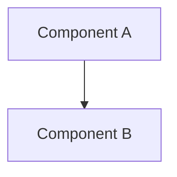

# design.md template (Kiro's official 6 headings)

The top-level headings must be exactly these 6, in English, in this order. Don't add, remove or rename them.

## Structure

````markdown
# Design Document

## Overview

[A summary of what you're building + the main design decisions (3-5 bullets).
 Write it so it's clear which requirements in requirements.md the design answers]

## Architecture

[An explanation of the system structure + a mermaid diagram]



## Components and Interfaces

[Per component: responsibilities / input-output interfaces (signatures, data shapes) / dependencies.
 Concrete code fragments, commands and schemas are welcome]

## Data Models

[The data structures involved. File formats, schemas and the shape of state, made concrete with JSON examples or tables]

## Error Handling

[A list of abnormal cases and how they're handled. Make them correspond to the IF ... THEN statements in requirements.md]

## Testing Strategy

[What is tested and how. The split between unit/integration/e2e, and how it maps to the acceptance criteria]
````

## Conventions

- Only add headings beneath each section (### and below)
- Keep mermaid blocks syntactically valid (a by-eye item in the self-check)
- Don't add features to the design that aren't in the requirements. Conversely, every Requirement must be
  reflected somewhere in the design
- Write code fragments concrete enough for an implementer to use as-is (closer to real code than pseudocode)
